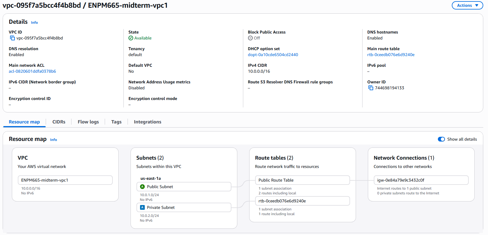
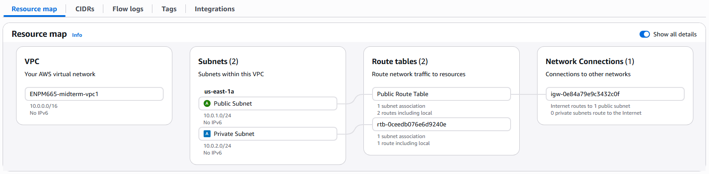
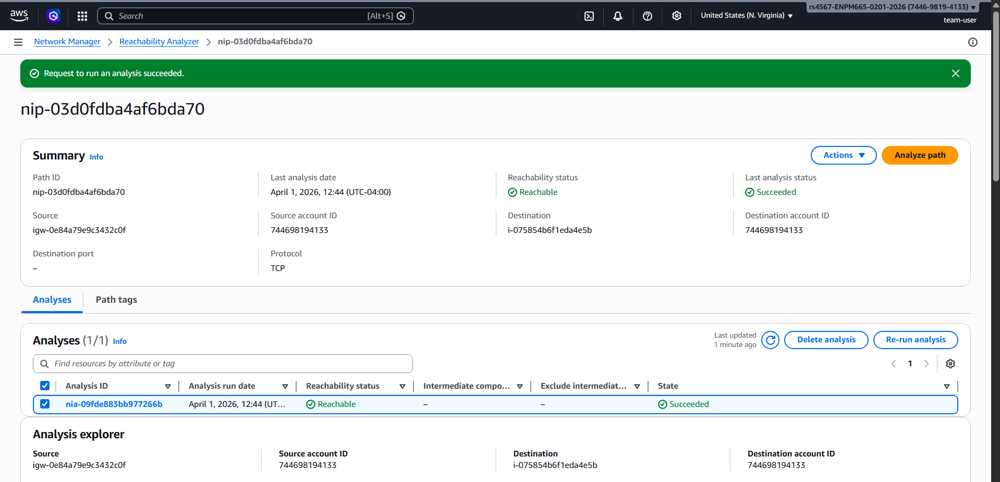
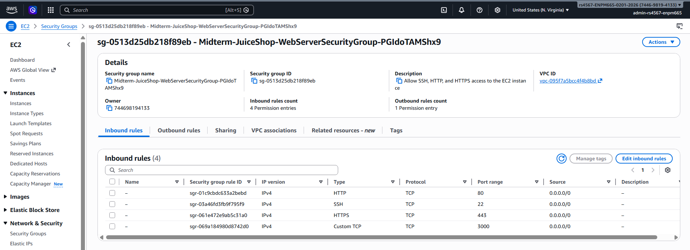
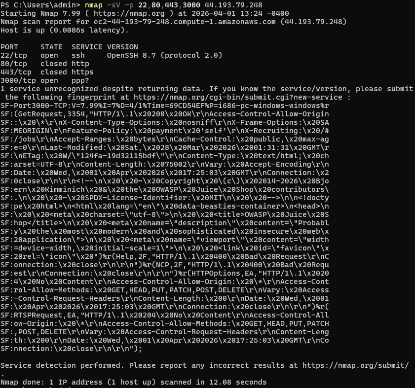
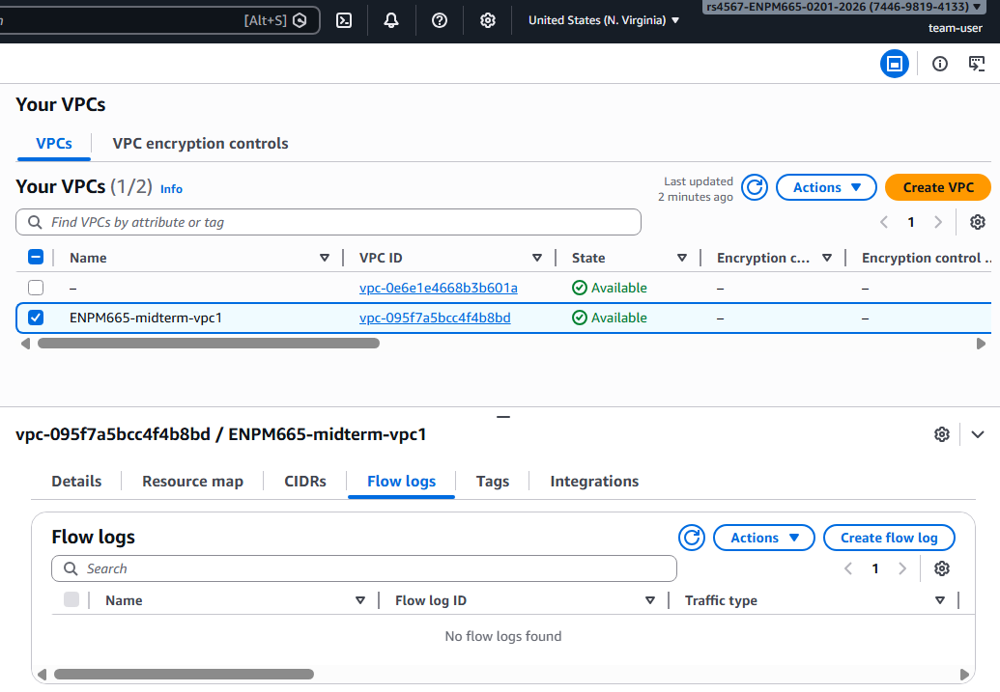
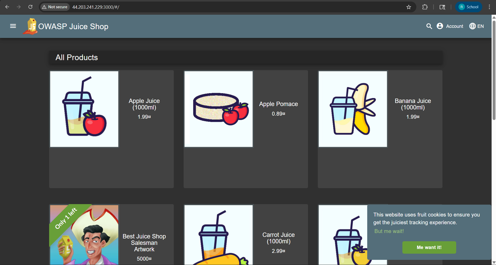

# AWS Security Lab

Cloud security assessment of a custom AWS environment hosting OWASP Juice Shop, including network segmentation, exposure validation, monitoring review, and remediation planning.

Designed and assessed a segmented AWS network environment. Built a custom VPC with public and private subnets, configured layered access controls, ran network reconnaissance, and produced a structured security findings report identifying six issues across exposure, access control, and visibility.

---

## What I Did

- Built a VPC (`10.0.0.0/16`) with separate public (`10.0.1.0/24`) and private (`10.0.2.0/24`) subnets in us-east-1
- Deployed an EC2 instance running OWASP Juice Shop and configured Security Groups and Network ACLs
- Used AWS Reachability Analyzer to map the network path from the Internet Gateway to the EC2 instance
- Ran Nmap (`-sV -p 22,80,443,3000`) against the public IP to confirm open ports and identify running services
- Reviewed VPC Flow Logs configuration, NAT Gateway setup, and NACL rules
- Documented all findings with severity ratings, evidence screenshots, and specific remediation steps

---
## Architecture

    Internet
        │
    Internet Gateway
        │
    Public Subnet (10.0.1.0/24)
        │   └── EC2: OWASP Juice Shop — ports 22, 80, 443, 3000
        │
    Private Subnet (10.0.2.0/24)
        └── [No NAT Gateway — no secure outbound path]

### VPC Overview



### Resource Map



### Reachability Analysis



Network ACL and Security Group details → [`architecture/vpc-topology.md`](architecture/vpc-topology.md)

---

## Evidence

### Security Group Configuration



### Nmap Validation



### Flow Logs Status



### Application Deployment



Full details with evidence → [`reports/security-assessment.md`](reports/security-assessment.md)  
One-page summary → [`reports/executive-summary.md`](reports/executive-summary.md)

---
## Findings

| ID | Severity | Finding |
|----|----------|---------|
| CRIT-01 | Critical | SSH (port 22) accessible from the Internet |
| CRIT-02 | Critical | Application directly exposed to the Internet |
| HIGH-01 | High | VPC Flow Logs disabled |
| HIGH-02 | High | Overly permissive Security Group rules |
| MED-01 | Medium | Network ACL provides minimal security value |
| LOW-01 | Low | Private subnet lacks outbound Internet connectivity |

--- 

## Repository

```text
aws-security-lab/
├── architecture/
├── reports/
├── screenshots/
└── scripts/
```

---

## Scripts

**`network-security-diagram.py`** — generates the visual findings summary using Matplotlib

    pip install matplotlib
    python scripts/network-security-diagram.py

**`flowlog_parser.py`** — parses VPC Flow Log files and summarizes rejected connections by source IP and destination port

    python scripts/flowlog_parser.py <flow-log-file>

---

## Stack

AWS VPC · EC2 · Security Groups · Network ACLs · NAT Gateway · VPC Flow Logs · Reachability Analyzer · Nmap · Python · Matplotlib
